

### 247

|Name          |RA          |DEC      | Ext[arcm] | Ext_ml | z    | Class| Rsig[arcmin] | CRsig[c/s] | CR500[c/s] | R500[Mpc] |L500[erg/s]|F500[erg/s/cm^2]| M500[Msun]|Tx[keV]|beta|GC(XSZ,Delta_z<0.01)| GC(OPT,Delta_z<0.01)|GC|alias|
|--------------|------------|------------|---|---|-----------|--------|------|------|----|----|----|----|----|----|----|----|----|----|---|
|[247](script/247.md)     | 96.594       | -53.687       | 4.25    | 1470.69   | 0.0551 | 2   | 31.613 |1.148 |1.060 |1.013 |1.380e+44 |1.908e-11 |3.114e+14 |4.391 |0.570 |Tar, |A, |Tar, A, |k495|

|[RASS image](../image/247/247_img.pdf)|[filtered image](../image/247/247_fil.pdf)|[Segment image](../image/247/247_seg.pdf)|
|-------------------|--------------------|-------------------|
| 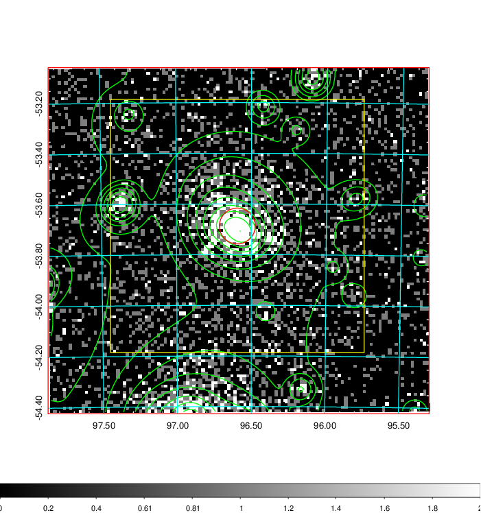  | 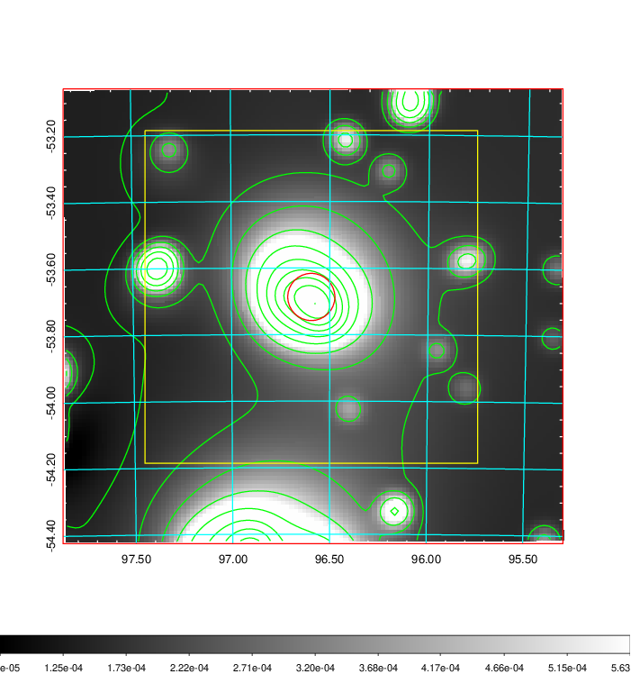   | 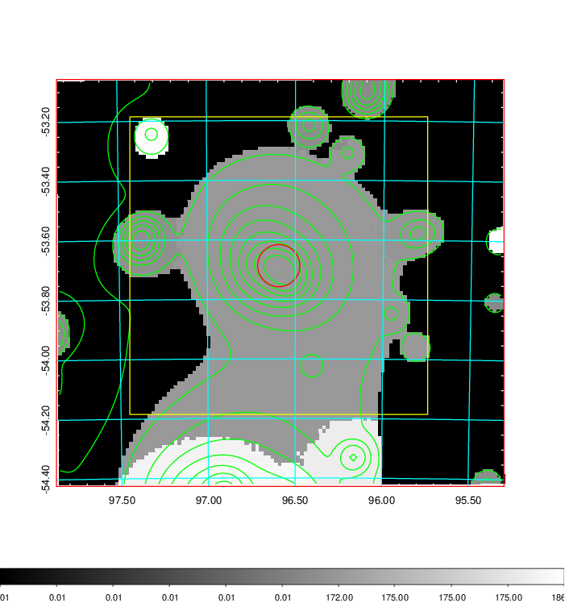  |

|[Exposure image](../image/247/247_mex.pdf)| [nH image](../image/247/247_nh.pdf)| [Planck image](../image/247/247_p.pdf)|
|-------------------|--------------------|-------------------|
|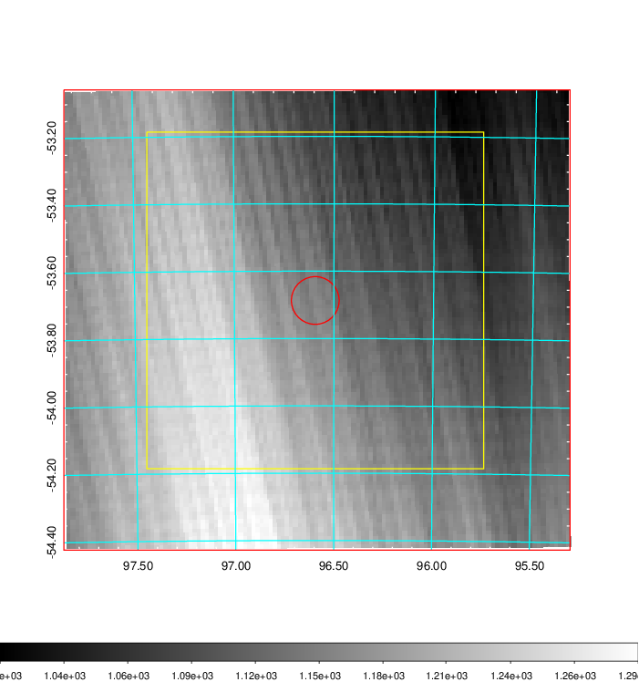   | 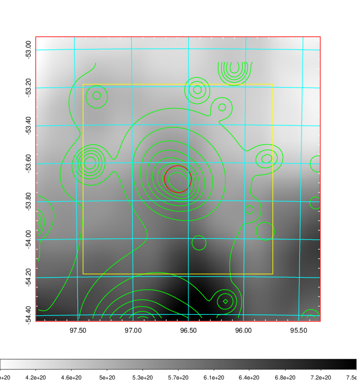    | 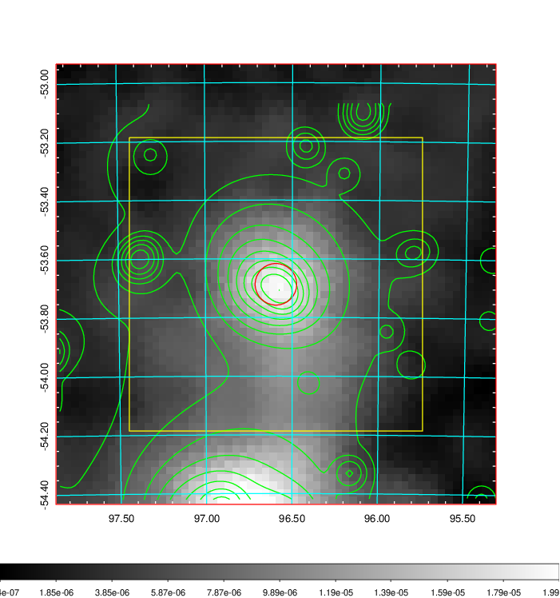 |

|[Redshift Histogram](../image/247/247_zg.pdf) | [DSS image(z1)](../image/247/247_dss_z1.pdf)      |  [DSS image(z2)](../image/247/247_dss_z2.pdf)    |
|-------------------|--------------------|-------------------|
|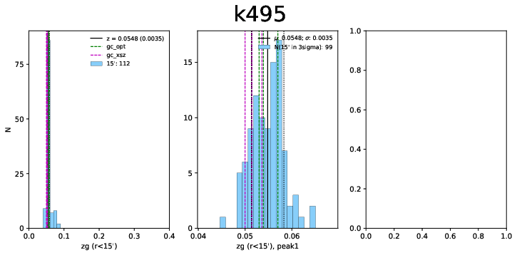 |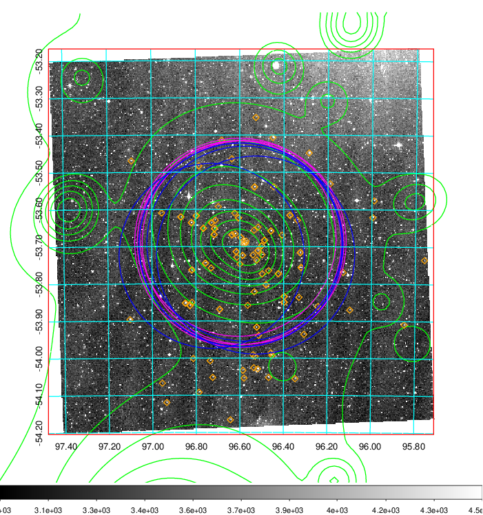  Blue circle for optical clusters;  Magenta circle for XSZ clusters;  all with r=1Mpc;  Only GC with Delta_z<0.01 are shown. | 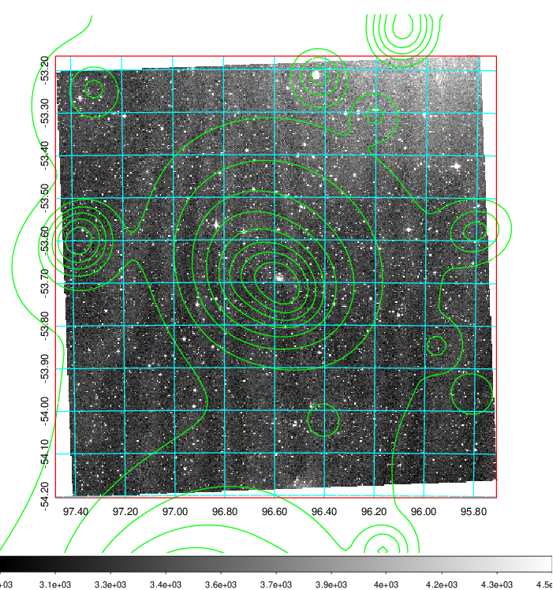 Blue circle for optical clusters;  Magenta circle for XSZ clusters;  all with r=1Mpc;  Only GC with Delta_z<0.01 are shown.  |

|[known Abell/XSZ clusters](../image/247/247_m.pdf) | [2MASS image](../image/247/247_2mass.pdf)      |
|-------------------|-------------------|
|  Blue and magenta circles for optical and  XSZ clusters, respectively with name and  redshift of clusters labelled. The  radius of circles are 1Mpc. Circles with  solid line for clusters with  Delta_z<0.01, and those with dashed  line for other XSZ/Abell clusters.        |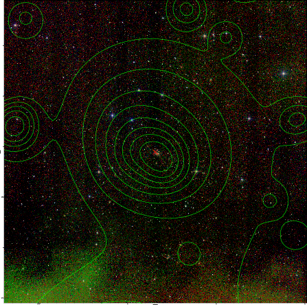  |

|[Growth Curve](../image/247/247_gca_all.png) |[Galaxies with z](../image/247/247_opt_ned.pdf) |[Galaxies with z](../image/247/247_opt_ned_zoom.pdf) |
|-------------------|-------------------|-------------------|
| 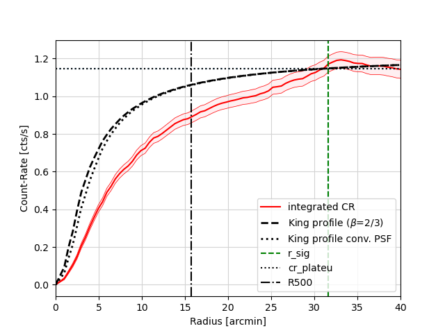  The growth curve.|    For candidates with X-ray or SZ clusters within 10':   - cyan for z<z_gc,xsz-0.01,   - green for z=z_gc,x-0.01~ z_gc,x+0.01,   - yellow for z=z_gc,sz-0.01~ z_gc,sz+0.01,   - white for z between z_gc,x and z_gc,sz, and Delta_z > 0.01,   - magenta for other galaxies;  For candiates with no XSZ clusters in 10':   - cyan for z=0-0.06,   - green for z=0.06-0.12,   - yellow for z=0.12-0.18,   - white for z=0.18-0.24,   - magenta for z=0.24-0.3,   - red for z>0.3 ;  |    Zoom-in image of the left image|

